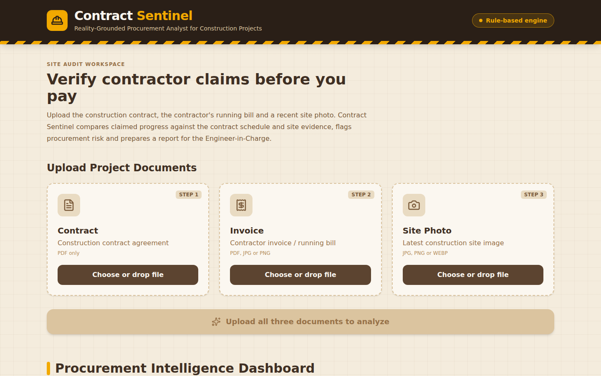
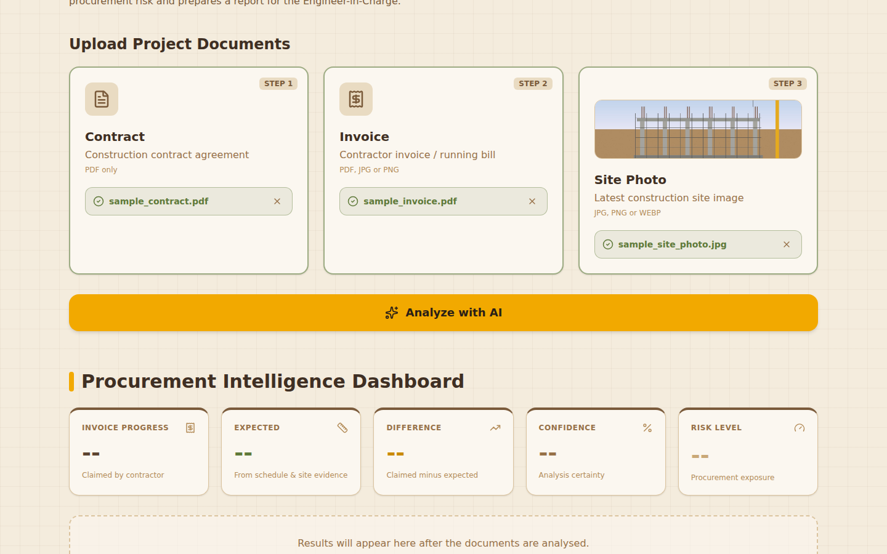
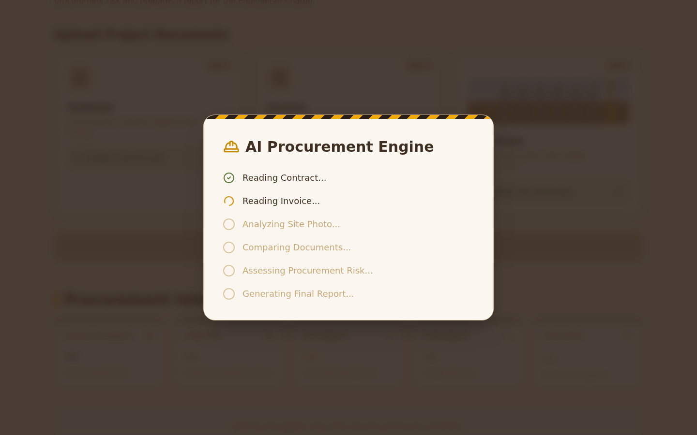
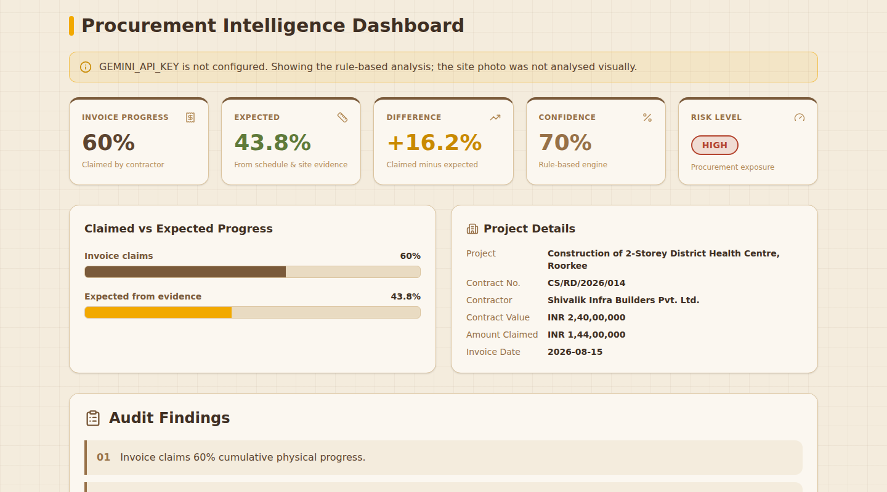
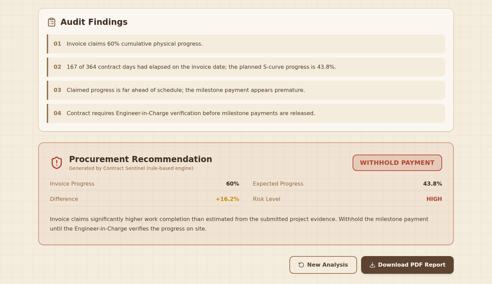
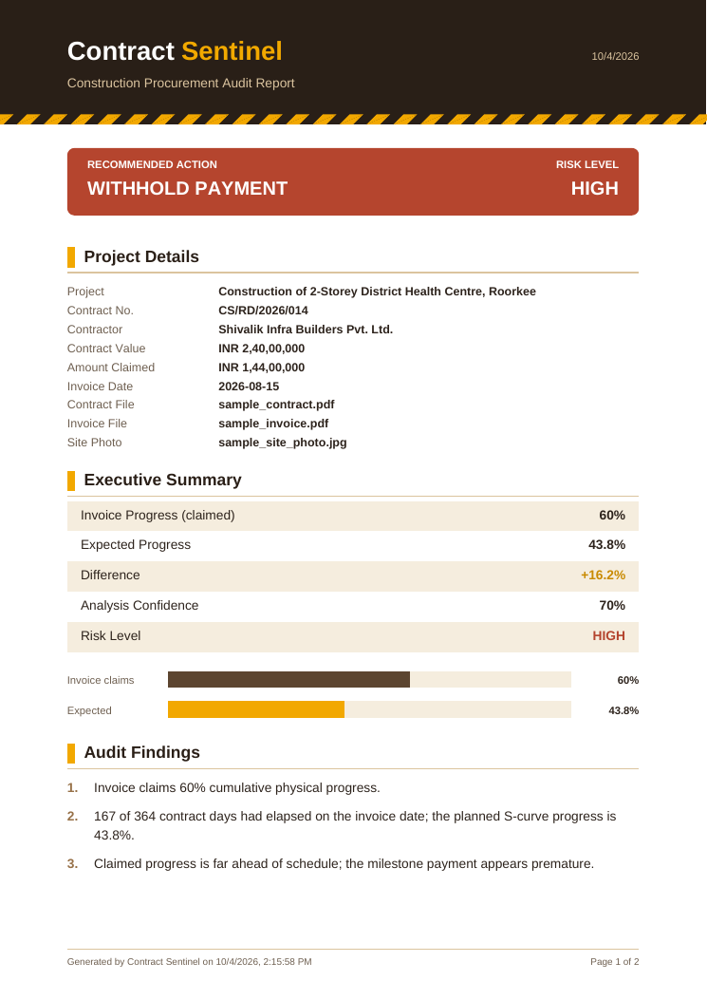
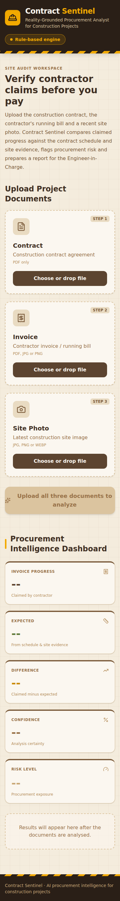

# 🛡️ Contract Sentinel

> AI-Powered Procurement Intelligence Platform for Construction Project Monitoring

Contract Sentinel is a full-stack AI application that helps project managers and procurement teams detect inconsistencies between construction contracts, contractor invoices, and project progress.

The platform analyzes uploaded documents, highlights procurement risks, generates actionable recommendations, and exports professional AI reports.

---

# ✨ Features

- 📄 Upload Construction Contract (PDF)
- 🧾 Upload Contractor Invoice (PDF or scanned image)
- 📷 Upload Site Progress Photo (with preview, drag & drop)
- 🤖 Gemini multimodal analysis of the contract, invoice **and** site photo
- 📐 Offline rule-based engine (works without an API key): reads the claimed progress from the invoice and the expected progress from the contract schedule using a construction S-curve
- 📊 Procurement Intelligence Dashboard (claimed vs expected progress, project details)
- ⚠ Consistent risk assessment (LOW / MEDIUM / HIGH) derived from the progress gap
- 📝 Risk-based procurement recommendation (Release / Verify / Withhold)
- 📥 Multi-page PDF audit report with proper text wrapping and page breaks
- 🏗️ Sand-brown construction theme with safety-stripe accents
- ⚡ FastAPI backend with input validation and automated tests

---

# 🖥️ Tech Stack

## Frontend

- React
- Vite
- Tailwind CSS
- Framer Motion
- Axios
- jsPDF
- Lucide Icons

## Backend

- FastAPI
- Python
- pdfplumber
- Google Gemini API (`google-genai`)
- pytest

---

# 🏗️ Architecture

```text
                React Dashboard
                       │
                 Axios API Calls
                       │
                  FastAPI Backend
                       │
        ┌──────────────┼──────────────┐
        │              │              │
        ▼              ▼              ▼
 PDF Extraction   Image Upload   Upload Validation
        │              │
        └──────┬───────┘
               ▼
     Gemini AI (multimodal) ──fails / no key──► Rule-based Engine
               │                                     │
               └──────────────┬──────────────────────┘
                              ▼
            Normalised Analysis (risk, recommendation)
                              │
                              ▼
                 Dashboard + PDF Audit Report
```

---

# 📸 Application Workflow

1. Upload Contract PDF
2. Upload Invoice
3. Upload Site Photo
4. AI Processing
5. Procurement Dashboard
6. Procurement Recommendation
7. Download PDF Report

Sample documents to try the workflow are included in [`docs/samples`](docs/samples).

---

# 📸 Screenshots

## Home



---

## Upload Documents



---

## AI Processing



---

## Procurement Dashboard



---

## Findings & Procurement Recommendation



---

## Generated PDF Report



---

## Mobile Layout



---

# 🚀 Installation

## Backend

```bash
cd backend

pip install -r requirements.txt

cp .env.example .env   # then add your GEMINI_API_KEY

uvicorn app:app --reload
```

Without a `GEMINI_API_KEY` the backend still runs and uses the built-in rule-based engine. The dashboard shows which engine produced each analysis.

| Variable | Description |
| --- | --- |
| `GEMINI_API_KEY` | Google Gemini API key (optional) |
| `GEMINI_MODEL` | Preferred Gemini model, tried before the built-in fallbacks (optional) |
| `ALLOWED_ORIGINS` | Comma-separated CORS origins (optional) |

Run the tests:

```bash
cd backend

python -m pytest
```

## Frontend

```bash
cd frontend

npm install

npm run dev
```

Set `VITE_API_URL` (see `frontend/.env.example`) if the backend is not running on `http://127.0.0.1:8000`.

---

# 🔌 API

| Method | Endpoint | Description |
| --- | --- | --- |
| `GET` | `/health` | Backend status and active analysis engine |
| `POST` | `/analyze` | Multipart upload of `contract` (PDF), `invoice` (PDF/image) and `photo` (image) |

---

# 📁 Project Structure

```text
ContractSentinel
│
├── backend
│   ├── services
│   │   ├── analysis_service.py   # rule-based engine + result normalisation
│   │   ├── document_service.py   # PDF text extraction
│   │   └── gemini_service.py     # Gemini multimodal analysis
│   ├── tests
│   ├── uploads
│   ├── app.py
│   └── requirements.txt
│
├── frontend
│   ├── src
│   │   ├── components
│   │   ├── pages
│   │   ├── services
│   │   └── utils
│   │
│   └── package.json
│
├── docs
│   ├── samples
│   └── screenshots
│
└── README.md
```

---

# 🔮 Future Improvements

- OCR for Scanned Documents
- Contractor Risk History
- GIS Integration
- Drone Image Analysis
- ERP Integration
- Multi-user Authentication

---

# 👨‍💻 Author

**Harsh Kumar**

M.Tech, IIT Roorkee

---

# 📄 License

MIT License